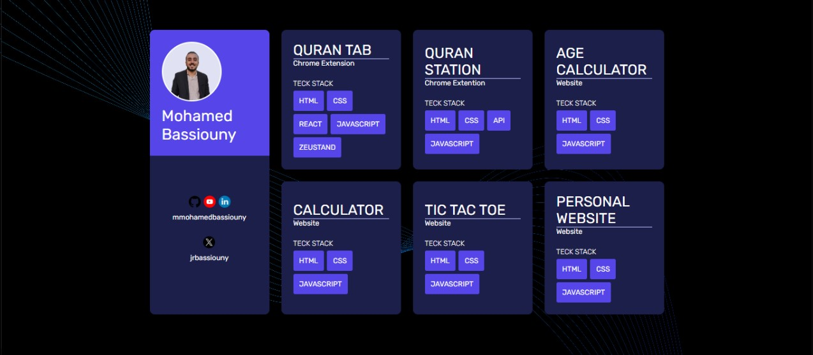

# Profile Dashboard

This is a **personal profile dashboard** showcasing a collection of projects and skills. The dashboard includes links to personal profiles and demonstrates several projects created using various technologies.

## 📋 Features

- **Personal Info Section**: Displays user information and social media links.
- **Projects Section**: Includes a list of personal projects with their technology stacks and descriptions.

## 🛠️ Technologies Used

- **HTML**: For the structure of the dashboard.
- **CSS**: For styling the dashboard.
- **SCSS**: To enhance the CSS with reusable and maintainable code.

## 📂 Projects Displayed

1. **Quran Tab** (Chrome Extension)
   - Stack: HTML, CSS, React, JavaScript, Zustand
2. **Quran Station** (Chrome Extension)
   - Stack: HTML, CSS, API, JavaScript
3. **Age Calculator** (Website)
   - Stack: HTML, CSS, JavaScript
4. **Calculator** (Website)
   - Stack: HTML, CSS, JavaScript
5. **Tic Tac Toe** (Website)
   - Stack: HTML, CSS, JavaScript
6. **Personal Website** (Website)
   - Stack: HTML, CSS, JavaScript

## 🎨 Screenshot



## 🚀 How to Run the Project

1. Clone the repository:
   ```bash
   git clone https://github.com/mmohamedbassiouny/Profile-Dashboard.git
2. Navigate to the project folder:
   cd your-repo-name
3. Open the index.html file in your browser to view the dashboard.


